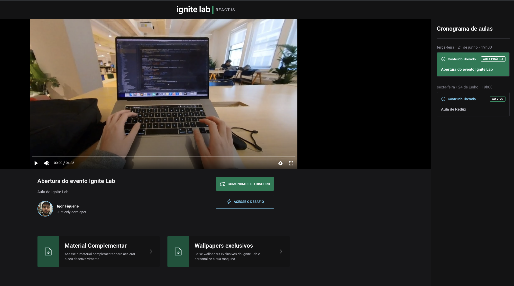
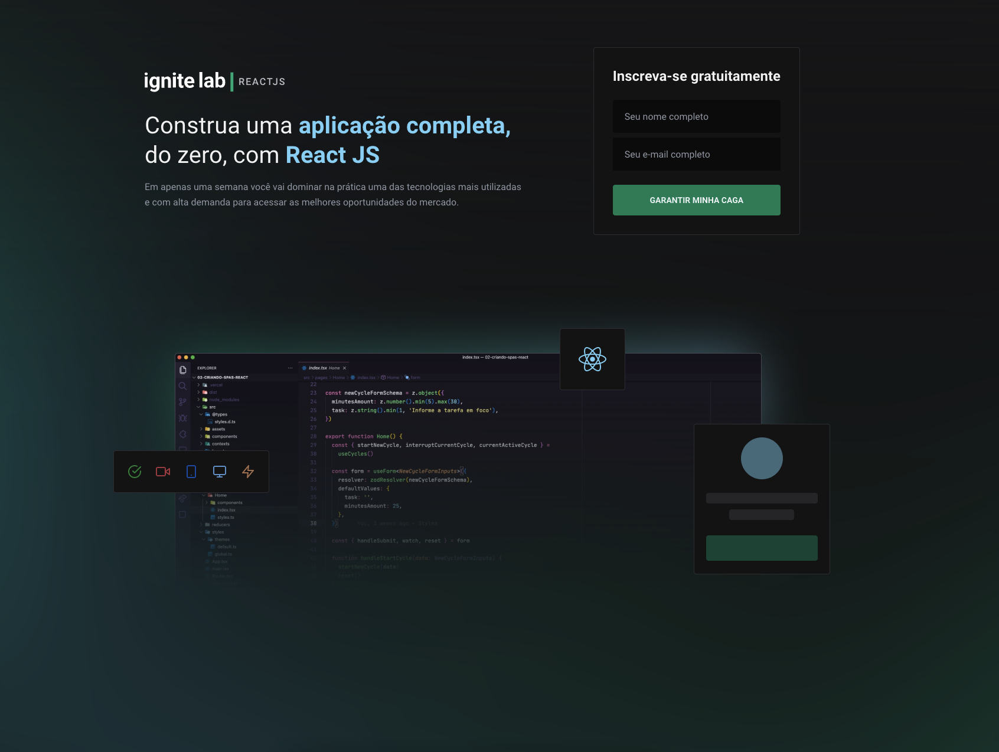

  

	
  

# 📖 Sobre o Projeto

Essa aplicação consiste em uma plataforma de vídeo aulas em que é possível cadastrar novas aulas dentro do GraphCMS, definir a data de exibição, cadastrar um usuário da plaforma além de relacionar cada aula para um professor.

# 📐 Layout

  

    
  

  

    
  

# 🚀 Tecnologias

- React.js
- Typescript
- SCSS
- GraphQL
- GraphCMS
- Tailwind

# ✅ Extras

- Ao acessar a página de eventos é redirecionado para o ultimo evento adicionaod.

# 🔧 Como rodar

- Clone o repositório `git clone git@github.com:igorfiquene/event-plataform.git`
- Acessa a pasta event-platarofm
- Rode `$ yarn install` para instalar as depêndencias do projeto e `$ yarn vite` para executar o projeto.

# :closed_book: License

Released in 2022 :closed_book: License

This project is under the [MIT license](./LICENSE).

Give a ⭐️ if this project helped you!

#

   <b> &#60;/&#62; by <a href="https://www.linkedin.com/in/igor-fiquene/">Igor Fiquene Pessoa</a></b>

